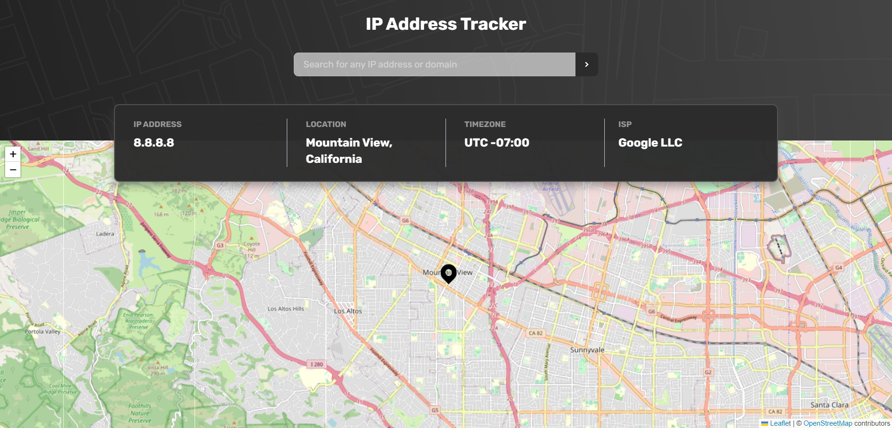
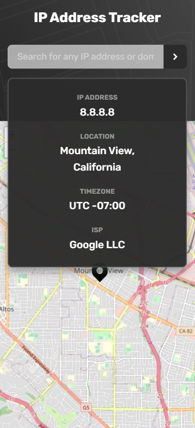

# Frontend Mentor - IP address tracker solution

## Overview

### The challenge

Users should be able to:

- View the optimal layout for each page depending on their device's screen size
- See hover states for all interactive elements on the page
- See their own IP address on the map on the initial page load
- Search for any IP addresses or domains and see the key information and location

### Screenshot

- Main: 
- Mobile: 

### Links

- Solution URL: https://github.com/Kevin-Mwole/ip-address-tracker
- Live Site URL: 


## My process

### Built with

- Semantic HTML5 markup
- Flexbox
- CSS Grid
- Mobile-first workflow
- [React](https://reactjs.org/) - JS library
- [Tailwind CSS](https://tailwindcss.com/docs/installation/using-postcss) - CSS framework

### What I learned

- Regex and testing for IP Address and Domain
```
const checkIpAddress =
    /^(([0-9]|[1-9][0-9]|1[0-9]{2}|2[0-4][0-9]|25[0-5])\.){3}([0-9]|[1-9][0-9]|1[0-9]{2}|2[0-4][0-9]|25[0-5])$/gi
const checkDomain =
  /^[a-zA-Z0-9][a-zA-Z0-9-]{1,61}[a-zA-Z0-9](?:\.[a-zA-Z]{2,})+/
```
```
const getEnteredAddress = async () => {
    const res = await fetch(
      `https://geo.ipify.org/api/v2/country,city?apiKey=${process.env.REACT_APP_API_KEY}&${
        checkIpAddress.test(ipAddress)
          ? `ipAddress=${ipAddress}`
          : checkDomain.test(ipAddress)
          ? `domain=${ipAddress}`
          : ""
      }`
    )
    const data = await res.json()
    setAddress(data) 
  }
```
